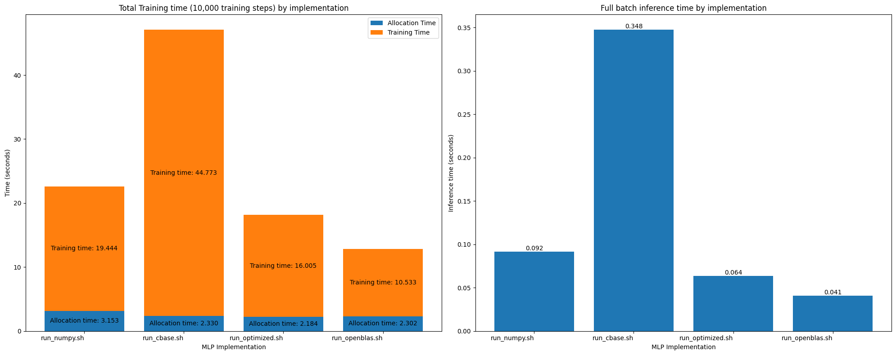
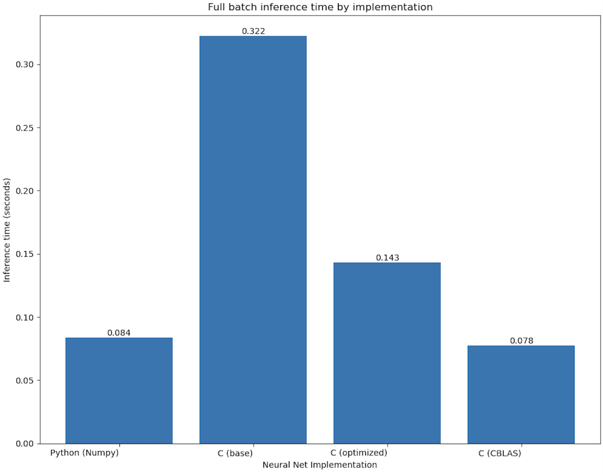

# MLP-Efficiency
Evaluates the impact of various methods for improving the speed (memory access, training, inference) of neural nets using implementations in Numpy, C with OpenBLAS, a baseline C program, 
and a C program I optimized myself, all benchmarked on the Fashion MNIST dataset.

Modern deep learning models consume substantial time and compute resources during training to such a degree that compute resources are often the limiting factor in performance.
MLPs trained for classification on the CPU offer a scaled-down version of this problem that can still provide insight into which deep learning acceleration methods are effective, and why.

## Usage

Quick start: run `python3 run.py` to watch all the models train in real time. Note that `run.py` calls`FMNIST_download.sh` which will download the Fashion MNIST dataset if it's not already downloaded.

Add a `-h` flag to view more available flags.

To run each MLP implementation individually, switch to its directory and run `./run_<implementation_name>.sh -<optional_flag_1> -<optional_flag_2>`. As before, use `-h` to view available flags.

Note: Some programs in this repository utilize instructions unique to Intel machines and will not run on other hardware. 

## Overview & Process 

I began this project by aiming to improve the training speed of the Python/NumPy implementation, hoping that bypassing the Python interpreter with a directly compiled C executable would 
reward me with a faster program. Of course, the Python program spent most of its time doing computations inside highly optimized NumPy calls; consequently, my baseline C program took
far longer to train than the original Python/NumPy implementation.

Follow-up implementations `C_optimized_nn` and `CBLAS_nn` reduce training time below NumPy's.

Since deep learning is matrix multiplication intensive, (the baseline program's matrix multiplication function accounted for 93% of its runtime) most optimizations in `C_optimized_nn`
are directed at matrix multiplication. For context against the optimal matrix multiplication performance, I called OpenBLAS's single-precision general matrix multiplication API in `CBLAS_nn`. 

The MLPs are trained with minibatch (default batch size 100) stochastic gradient descent. Each implementation performs a forward pass on all 60,000 images at a default interval of every 100 training
steps to calculate and display train and test accuracy. Since full-dataset forward passes are 6,000x larger than training forward passes, adjusting their frequency can simulate training on a 
larger model/dataset. 

Unsurprisingly, existing methods (NumPy, OpenBLAS) are easily the best options for manually constructing deep learning models. Still, experimenting with custom 
implementations offers otherwise inaccessible insight into how and why efficient implementations are effective.  

## Optimization methods

Experimentation with several techniques in `C_optimized_nn` yielded a matrix multiplication function that outperforms Python/NumPy in training time.

### Base implementation
The base C implementation holds data in 2d arrays and performs matrix multiplication using using the triple for loop method. The innermost loop iterates over the longest
(batch) dimension, contributing to very strong cache spatial locality. In fact, the ordering of the `for` loops influences the speed of matrix multiplication by a factor of 
about eight.

### Memory structure
The optimized C implementation further improves cache locality by storing matrices in 1D arrays.
This format stores the entire matrix contiguously in memory, which is important because loading in data from the end of one matrix row will likely also load in data 
from the beginning of the next.

### Matrix Multiplication Algorithm
Further improvements proved challenging, since conventional efficient matrix multiplication techniques (Strassen's algorithm, matrix blocking, matrix transposition) 
failed to outperform the original `for` loops. This is likely because the largest matrix multiplications are oddly shaped: (eg, (30, 785)x(785, 42000)).

### Reduction & Parallelization of Instructions 
Implementing SIMD instructions and efficient pointer arithmetic dramatically improved performance, but only when compiled without optimization flags. 
Inspection of the base and optimized matrix multiplication function assembly code confirmed that these optimizations are automatically enabled when compiling with the 
-Ofast flag. The following observations are based on programs compiled without an optimization flag. 

Utilizing pointer arithmetic and loop hoisting in place of the standard array indexing used in the base implementation dramatically reduces the number of operations 
necessary to access matrix elements. Array indexing operations are small, but streamlining them is still valuable because the instructions in the innermost `for` loop 
undergo considerable repetition.

SIMD instructions enable the program to multiply and add eight floats in parallel on the CPU, cutting the entire program's runtime roughly in half when implemented in matrix
multiplication. 

### Multithreading
Introducing multithreading to the matrix multiplication function significantly improved performance regardless of optimization flags. 
For large matrices, splitting the batch dimension calculations across 10 threads barely affected cache misses and parallelized the function, 
making the program competitive with NumPy, which also utilizes multithreading.

## Analysis

The following figures were computing using `perf stat -e cache-misses,cache-references,instructions,cycles ./mnist_nn -iterations 100 -nodisplay`

Cache misses (base): 21495784
21495784      cache-misses, 268371507      cache-references                                                      

Cache misses (optimized)
18940843      cache-misses, 262199995      cache-references                                             

Cache misses (CBLAS):
19435207      cache-misses, 129537933      cache-references                   

The base C implementation has the most of both cache references and misses. 
The optimized version likely reduces both of these for two reasons: First, the optimized
implementation stores matrices in 1-dimensional arrays rather than 2-dimensional, which means that even very large matrices are stored contiguously in memory. 
Second, The optimized implementation employs multithreading, which should utilize multiple CPU cores, each of which contributes an L1 and often an L2 cache, 
resulting in more total cache memory. 

CBLAS falls in between the others in cache misses, but has far less total references, likely due to the use of a technique such as Strassen's that reduces the number of 
memory accesses and other powerful algorithmic optimizations. Unsurprisingly, it's a balance between efficient algorithms and efficient memory access patterns that yields
optimal performance.

On that note, efficiently training deep learning models is dependent on more than just hardware oriented optimizations. A basic example of this is the usage of He weight
initialization rather than sampling from a uniform distribution. The neural networks in this project trained to 90% accuracy with He initialization in just 100-200 
training steps, far more efficient than the 500-1000 steps needed to reach 90% accuracy with weights sampled from a uniform distribution on the interval [-0.5, 0.5].
Similarly, minibatch gradient descent is a logical choice to replace the slow, expensive process of full-batch gradient descent on a sizeable dataset.

## Acknowledgements

The following resources were vital to this project:

[Python/NumPy MLP](https://www.kaggle.com/code/wwsalmon/simple-mnist-nn-from-scratch-numpy-no-tf-keras) This program forms the backbone of the NumPy implementation in this repo.

[Matrix Multiplication Optimization Lecture](https://ocw.mit.edu/courses/6-172-performance-engineering-of-software-systems-fall-2018/resources/lecture-1-intro-and-matrix-multiplication/) This lecture and pieces of other lectures from the same course established my understanding of optimizing matrix multiplication and introduced me to the most effective methods.

[BLISlab: A Sandbox for Optimizing GEMM](https://github.com/flame/blislab) Helped me learn through experimentation what works and what doesn't in optimizing matrix multiplication.

[Fashion MNIST dataset](https://github.com/zalandoresearch/fashion-mnist)

[MNIST dataset](https://pjreddie.com/projects/mnist-in-csv/)

