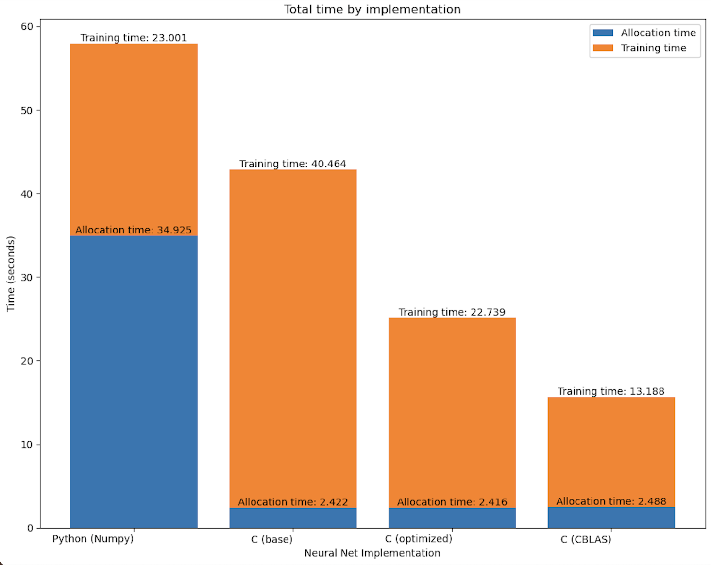

# MLP-Efficiency
Evaluates the impact of various methods for improving the speed (memory access, training, inference) of neural nets using implementations in Numpy, OpenBLAS, and two of 
my own C programs, all benchmarked on the MNIST dataset. 

Modern deep learning models frequently exceed 100 billion parameters, consuming substantial time and resources during training, making efficient implementations vital.
CPU-based MLP implementations trained for classification on the MNIST dataset offer a small scale version of this problem from which to evaluate the effectiveness of 
several methods to accelerate deep learning tasks. 

All references to training time or efficiency between NumPy and C implementations will be made with respect to training and accuracy calculation time, disregarding 
the initial time each program needs to load the dataset into memory. It's apparent in the above bar graph that the direct memory access of C makes this segment not worth 
comparing.

## Usage

Quick start: run `python3 script.py` to watch all the models train in real time. Add the `-visualize` flag to recreate the charts seen in this file. Note that `script.py` calls
`download.sh` which will download the MNIST dataset if it's not already downloaded.

Run `python3 main.py` or `make` then `./mnist_nn` after changing to a program's directory to experiment with individual implementations.
Several flags controlling batch size, additional visualizations, training iterations and more are already included, and are viewable by running the program with `-h` after it.

Note: The programs in this repository utilize instructions unique to Intel machines and will not run on other hardware. If a required library (NumPy or OpenBLAS), is not 
installed, the Python script will skip the implementation that requires it and proceed with the others.

## Takeaways

I began this project by aiming to improve the training speed of the NumPy implementation, assuming that the extra effort of rewriting the program in C would reward me with a 
faster program since it bypasses the Python interpreter with a directly compiled C executable. 

NumPy is a highly optimized library and so the first C program I wrote took far longer to train than the original NumPy implementation. 
It's well known that deep learning is very matrix multiplication intensive, and the base C implementation confirms this anecdotally: its matrix multiplication
function accounted for 93% of its runtime. Consequently, the focus of the optimizations is centered on matrix multiplication.

After researching and tinkering with a number of optimization techniques for matrix multiplication, I wrote an optimized variant of the C program, which outperforms the 
NumPy implementation by a narrow margin.
Finally, I OpenBLAS's single-precision general matrix multiplication API in a third C implementation as context with the true best performance on this task.

Unsurprisingly, existing methods (NumPy, OpenBLAS) are easily the best options for manually constructing deep learning models. Still, experimenting with custom 
implementations offers otherwise inaccessible insight into how and why efficient implementations are effective.  

## Optimization methods

Training on MNIST with minibatch (default size 100) stochastic gradient descent is too small of a problem to properly demonstrate optimizations, so
the programs' default settings require a forward pass on all 60,000 patterns every 100 training steps to calculate train and test accuracy. These input matrices, being 6,000 
times larger than training batches, account for the bulk of computation time and optimizations are therefore directed at them.

The base C implementation holds data in 2d arrays and performs matrix multiplication using using the triple for loop method. The innermost loop iterates over the longest
(batch) dimension, contributing to very strong cache spatial locality. In fact, the ordering of the `for` loops influences the speed of matrix multiplication by a factor of 
about eight.

The optimized C implementation further improves cache locality by storing matrices in 1D arrays.
This means that the entire matrix is stored contiguously in memory, which is important because loading in data from the end of one matrix row will likely also load in data 
from the beginning of the next.

Further improvements proved challenging, since conventional efficient matrix multiplication techniques (Strassen's algorithm, matrix blocking, matrix transposition) failed to outperform the original `for` loops on the unevenly shaped input matrix. Implementing SIMD instructions and efficient pointer arithmetic dramatically improved performance, but only when compiled without optimization flags. Inspection of the base and optimized matrix multiplication function machine code confirmed that SIMD instructions, efficient pointer arithmetic, 
and loop unrolling are automatically enabled when compiling with the -O3 flag, further narrowing opportunity for improvement.

What did significantly improve performance was introducing a multithreading option for large input matrices into the matrix multiplication function. Splitting the batch 
dimension calculations across 10 threads barely affected cache misses and parallelized the function, making it competitive with NumPy, which also utilizes multithreading.

## Analysis

The following figures were computing using `perf stat -e cache-misses,cache-references,instructions,cycles ./mnist_nn -iterations 100 -nodisplay`

Cache misses (base): 21495784
21495784      cache-misses                     #    8.01% of all cache refs         
268371507      cache-references                                                      

Cache misses (optimized)
18940843      cache-misses                     #    7.22% of all cache refs         
262199995      cache-references                                             

Cache misses (CBLAS):
19435207      cache-misses                     #   15.00% of all cache refs         
129537933      cache-references                   

The base C implementation has the most of both cache references and misses. The optimized version likely reduces both of these for two reasons: First, the optimized implementation
stores matrices in 1-dimensional arrays rather than 2-dimensional, which means that even very large matrices are stored continguously in memory. Second, The optimized implementation
employs multithreading, which should utilize multiple CPU cores, each of which contributes an L1 and often an L2 cache, resulting in more total cache memory. 
CBLAS falls in between the others in cache misses, but has far less total references, likely due to the use of a technique such as Strassen's that reduces the number of 
memory accesses and other powerful algorithmic optimizations. Unsurprisingly, it's a balance between efficient algorithms and efficient memory access patterns that yields optimal
performance.

On that note, efficiently training deep learning models is dependent on more than just hardware oriented optimizations. 
A basic example of this is the usage of He weight
initialization rather than sampling from a uniform distribution. The neural networks in this project trained to 90% accuracy with He initialization in just 100-200 
training steps, roughly 80% faster than the 500-1000 steps needed to reach 90% accuracy with weights sampled from a uniform distribution on the interval [-0.5, 0.5].

## Acknowledgements

The following resources were vital to this project:

[Python/NumPy MLP](https://www.kaggle.com/code/wwsalmon/simple-mnist-nn-from-scratch-numpy-no-tf-keras) This program forms the backbone of the NumPy implementation in this repo.

[Matrix Multiplication Optimization Lecture](https://ocw.mit.edu/courses/6-172-performance-engineering-of-software-systems-fall-2018/resources/lecture-1-intro-and-matrix-multiplicati
on/) This lecture and pieces of other lectures from the same course established my understanding of optimizing matrix multiplication and introduced me to the most effective methods.

[BLISlab: A Sandbox for Optimizing GEMM](https://github.com/flame/blislab) Helped me learn through experimentation what works and what doesn't in optimizing matrix multiplication.

[MNIST dataset] (https://pjreddie.com/projects/mnist-in-csv/)

